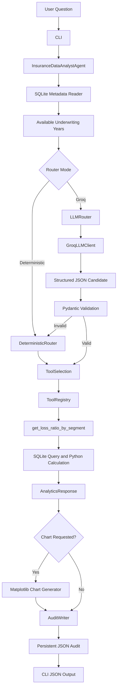
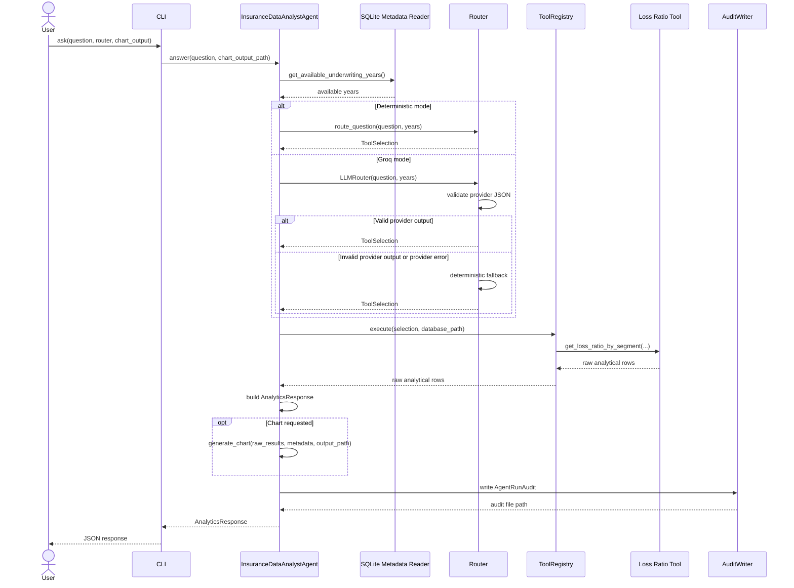

# System Architecture

## Purpose

This document describes the architecture of the **Insurance Data Analyst Agent**.

The application answers selected analytical questions about a synthetic insurance portfolio. It routes a question to an explicitly authorized tool, validates all tool arguments, runs deterministic SQLite and Python calculations, optionally generates a chart, and persists a complete JSON audit artifact.

The project demonstrates a controlled analytical-agent design for insurance portfolio exploration. It is not a production underwriting, pricing, claims, reserving, or coverage-determination system.

## Design Goals

The system is built around the following goals:

- **Controlled tool use:** The application executes only allow-listed analytical tools.
- **Deterministic calculations:** Business metrics are calculated in Python and SQLite, not by the LLM.
- **Validated inputs:** Tool names, dimensions, years, provinces, and lines of business are validated with Pydantic.
- **Auditability:** Every execution records the question, routing result, tool calls, arguments, raw results, response, and errors where applicable.
- **Reproducibility:** Synthetic data is generated from an explicit seed and stored locally in SQLite.
- **Provider independence:** Provider-specific SDK code is isolated behind an `LLMClient` contract.
- **Safe fallback:** The deterministic router remains available when an LLM provider fails or returns invalid output.
- **Controlled visualization:** Charts are generated by Python from approved metadata and analytical results.

## High-Level Architecture



The route to a tool is controlled before calculation begins. The LLM may propose a structured tool selection, but it cannot directly execute SQL, Python code, shell commands, arbitrary functions, or external actions.

## Main Components

| Component | Responsibility | Provider-specific |
|---|---|---:|
| `cli.py` | Parses commands, builds dependencies, returns JSON or controlled errors | No |
| `config.py` | Loads validated runtime settings from environment variables | No |
| `database.py` | Retrieves controlled metadata from the SQLite portfolio database | No |
| `models/analytics.py` | Defines analytical requests, responses, metrics, chart metadata, and validation rules | No |
| `models/routing.py` | Defines the validated `ToolSelection` contract | No |
| `models/audit.py` | Defines persistent audit-record contracts | No |
| `services/router.py` | Implements deterministic question routing and filter extraction | No |
| `services/llm_router.py` | Validates LLM output and applies deterministic fallback | No |
| `services/agent.py` | Orchestrates routing, tool execution, response building, chart generation, and auditing | No |
| `services/response_builder.py` | Builds structured user-facing analytical responses | No |
| `services/audit_writer.py` | Writes versioned JSON audit artifacts | No |
| `tools/registry.py` | Maintains the allow-list of analytical tools and executes registered handlers | No |
| `tools/loss_ratio.py` | Implements the paid loss-ratio calculation | No |
| `charts.py` | Generates approved chart types from results and chart metadata | No |
| `llm/base.py` | Defines the provider-agnostic `LLMClient` protocol | No |
| `llm/fake.py` | Provides deterministic LLM behavior for tests | No |
| `llm/groq_client.py` | Implements the `LLMClient` contract using the Groq SDK | Yes |
| `synthetic_data/generator.py` | Builds the reproducible synthetic SQLite dataset | No |

## Data Architecture

The V1 portfolio is stored in a local SQLite database generated from a deterministic seed.

### `policies`

| Field | Description |
|---|---|
| `policy_id` | Stable synthetic policy identifier |
| `province` | Portfolio province code, such as `QC` or `ON` |
| `line_of_business` | Insurance product segment |
| `underwriting_year` | Year in which the policy was written |
| `written_premium` | Synthetic written premium amount |

### `exposure`

| Field | Description |
|---|---|
| `exposure_id` | Stable synthetic exposure identifier |
| `policy_id` | Associated policy identifier |
| `exposure_year` | Exposure period year |
| `exposure_units` | Synthetic exposure amount |

### `claims`

| Field | Description |
|---|---|
| `claim_id` | Stable synthetic claim identifier |
| `policy_id` | Associated policy identifier |
| `claim_year` | Claim year |
| `claim_type` | Synthetic claim category |
| `paid_amount` | Synthetic paid claim amount |

### Data constraints

The synthetic generator uses:

- A fixed random seed for reproducibility.
- A limited set of provinces: `QC`, `ON`, `BC`, and `AB`.
- A limited set of lines of business: `commercial_property`, `commercial_auto`, and `general_liability`.
- Synthetic claim-frequency adjustments by product, geography, and year to make future trend-analysis scenarios possible.

No real policyholder, broker, claims, pricing, or customer data is used.

## Query Sequence



## Routing Architecture

### Deterministic routing

The deterministic router is the default routing mode. It recognizes an intentionally limited vocabulary in English and French.

Examples of supported normalized concepts:

| User wording | Normalized internal value |
|---|---|
| `loss ratio` | Loss-ratio analytical intent |
| `paid loss ratio` | Loss-ratio analytical intent |
| `ratio de sinistralité` | Loss-ratio analytical intent |
| `Quebec`, `Québec`, `QC` | `QC` |
| `commercial property`, `propriété commerciale` | `commercial_property` |
| `commercial auto`, `automobile commerciale` | `commercial_auto` |
| `general liability`, `responsabilité civile générale` | `general_liability` |
| `last three underwriting years` | Latest three underwriting years available in SQLite |

The router rejects unsupported questions rather than attempting an approximate calculation.

### LLM-assisted routing

`LLMRouter` uses an implementation of `LLMClient` to propose a JSON-compatible tool-selection candidate.

```text
Provider JSON response
    ↓
ToolSelection.model_validate(...)
    ↓
Validate against available underwriting years
    ↓
Validate fixed dimensions for the selected metric
    ↓
Use valid selection or fall back deterministically
```

The LLM output is treated as untrusted input. It cannot bypass:

- The fixed `ToolSelection` schema.
- Allowed province validation.
- Allowed line-of-business validation.
- Underwriting-year availability checks.
- ToolRegistry authorization.
- Deterministic calculation logic.

## Tool Authorization

`ToolRegistry` is the execution boundary for analytical capabilities.

The current V1 allow-list contains only:

```text
get_loss_ratio_by_segment
```

The registry maps each authorized tool name to an explicitly registered Python handler. The application rejects duplicate registrations and unknown tool names.

```text
ToolSelection
    ↓
ToolRegistry.get(tool_name)
    ↓
RegisteredTool.handler
    ↓
Deterministic analytical function
```

No router, user input, LLM response, or prompt can provide a Python import path, function name outside the allow-list, or SQL statement for execution.

## Loss-Ratio Calculation

The current V1 metric is a paid loss ratio:

```text
paid_loss_ratio = total_paid_claim_amount / total_written_premium
```

The calculation follows these steps:

1. Aggregate paid claim amounts at the `policy_id` level.
2. Join the aggregated claim amount to policies.
3. Apply validated underwriting-year, province, and line-of-business filters.
4. Group results using only allow-listed dimensions.
5. Aggregate written premium and paid claim amount.
6. Calculate the ratio with a zero-denominator guard.

The claim aggregation before the policy join is a material integrity control. It prevents a one-to-many relationship between policies and claims from duplicating written premium in the denominator.

```text
Incorrect pattern
policies LEFT JOIN claims
    ↓
A policy with two claims may contribute premium twice

Controlled pattern
claims aggregated by policy
    ↓
policies LEFT JOIN claims_by_policy
    ↓
Each policy contributes premium once
```

## Response and Chart Contract

The application returns `AnalyticsResponse`, which includes:

- The original question.
- Tool calls and validated arguments.
- Raw analytical rows.
- A deterministic explanation.
- Chart metadata.
- Audit metadata.

The chart layer accepts the raw results and `ChartMetadata`. In V1, it supports an allow-listed `grouped_bar` chart type.

```text
AnalyticsResponse.chart metadata
    ↓
charts.generate_chart(...)
    ↓
Matplotlib PNG file
```

The router and LLM never generate Matplotlib code. They can only select predefined metadata represented by the Pydantic model.

## Audit Architecture

Every invocation of `InsuranceDataAnalystAgent.answer()` produces an `AgentRunAudit` JSON artifact in `output/audits/`.

### Successful audit

A successful audit contains:

```text
run_id
timestamp_utc
agent_version
dataset_version
database_path
question
status = success
tool_calls
raw_results
final_response
```

### Failed audit

A failed audit contains:

```text
run_id
timestamp_utc
agent_version
dataset_version
database_path
question
status = failed
error.error_type
error.message
```

If an error occurs after tool selection, the audit preserves the validated tool arguments and marks the tool call as failed.

Audit files are written through a temporary file and replacement step to reduce the risk of leaving incomplete JSON artifacts.

## Configuration and Secrets

Runtime configuration is loaded through `pydantic-settings` from environment variables and `.env`.

```dotenv
DATABASE_PATH=data/insurance_portfolio.db
AUDIT_DIRECTORY=output/audits
DATASET_VERSION=synthetic-v1

GROQ_API_KEY=
GROQ_MODEL=
```

### Tracked by Git

```text
Source code
Tests
Synthetic data generator
Documentation
Evaluation fixtures
.env.example
pyproject.toml
uv.lock
GitHub Actions workflow
```

### Never tracked by Git

```text
.env
API keys
Provider credentials
Real policyholder information
Real claims data
Confidential policy or underwriting data
Locally generated database files when not intended as fixtures
Generated audit files
Generated charts
```

## Failure Handling

The system fails safely by rejecting invalid requests and retaining execution context in an audit artifact.

| Condition | Required behavior |
|---|---|
| Empty question | Raise a controlled unsupported-question error |
| Unsupported analytical intent | Reject without executing a tool |
| Requested year unavailable in the database | Reject rather than substitute another year |
| Missing database | Raise a controlled file error and persist a failed audit |
| Unknown tool | Raise `ToolNotFoundError` |
| Invalid LLM JSON | Fall back to deterministic routing |
| Invalid LLM tool name | Fall back to deterministic routing |
| Invalid LLM filter value | Fall back to deterministic routing |
| Provider request failure | Fall back to deterministic routing |
| Empty analytical result for chart generation | Reject chart creation and persist failed context |
| Unsupported chart type | Reject chart creation and persist failed context |

The fallback router does not make unsupported metrics available. If both the LLM route and deterministic route cannot handle a question, the application returns a controlled error instead of inventing an answer.

## Quality Strategy

The project uses several layers of testing.

| Test layer | Purpose |
|---|---|
| Unit tests | Validate models, router helpers, database helpers, chart generation, audit writing, and provider adapters in isolation |
| Calculation-integrity tests | Detect premium duplication and confirm metric formulas |
| Registry tests | Confirm only registered tools execute |
| CLI tests | Validate commands, standard output, standard error, and exit behavior |
| Agent tests | Validate complete orchestration with a temporary SQLite database and temporary audit directory |
| Router evaluation cases | Validate English/French question handling, expected arguments, and controlled rejection cases |
| LLM-router tests | Validate provider output validation and deterministic fallback using `FakeLLMClient` |
| CI | Run formatting, linting, tests, and coverage checks for every push and pull request |

The CI workflow runs:

```text
uv sync --locked
ruff format --check
ruff check
pytest
coverage threshold
```

## Extensibility

The architecture is intentionally prepared for additional analytical tools.

### Planned V1.1 tools

```text
get_claim_frequency_trend
get_exposure_summary
get_portfolio_quality_metrics
```

Each tool should add:

1. A Pydantic request contract.
2. Deterministic Python/SQLite calculation logic.
3. Registry registration.
4. Router vocabulary and evaluation cases.
5. Calculation-integrity tests.
6. Response-builder support.
7. Chart metadata and rendering support when relevant.
8. Documentation of metric definitions and limitations.

### Future delivery interfaces

Because CLI concerns are separated from orchestration, the same `InsuranceDataAnalystAgent` can later be used by:

- A FastAPI API.
- A Streamlit interface.
- A notebook demonstration.
- A scheduled reporting job.
- A broader underwriting-agent workflow.

## Current Limitations

- V1 supports only paid loss-ratio analysis.
- Premium is written premium, not earned premium.
- Claims use paid amounts only and do not model case reserves, incurred losses, ultimate losses, or development.
- The data is synthetic and not representative of any production insurer.
- Accident-year, calendar-year, reserving, and triangle analyses are outside the V1 scope.
- The deterministic router recognizes a limited English and French vocabulary.
- The Groq adapter supports routing assistance only; it does not perform insurance calculations.
- A real external provider requires locally configured credentials and should not be part of deterministic CI tests.
- The application is a portfolio project and does not provide underwriting, pricing, coverage, or claims decisions.
